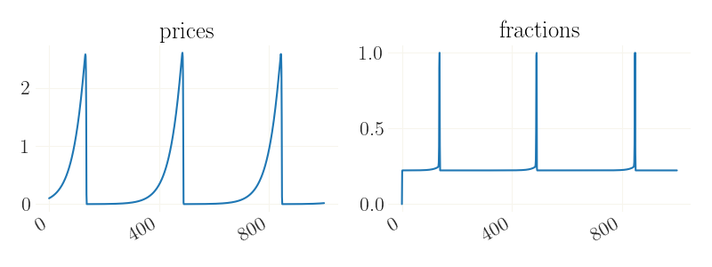

econpizza
=========

Contains simple tools to simulate perfect foresight models. The method is similar to the one introduced in Boehl & Hommes (2021), where we use it to solve for chaotic asset price dynamics. It can be understood as a policy function iteration where the initial state is the only fixed grid point and all other grid points are chosen endogenously (as in a "reverse" EGM) to map the expected trajectory.

The main advantage (in terms of robustness) over Fair-Taylor comes from exploiting the property that most determined perfect forsight models be a contraction mapping both, forward and backwards. The model is given by

.. code-block::

    f(x_{t-1}, x_t, x_{t+1}) = 0.

We iterate on the expected trajectory itself instead of the policy function. We hence require

.. code-block::

   d f(x_{t-1}, x_t, x_{t+1} ) < d x_{t-1},
   d f(x_{t-1}, x_t, x_{t+1} ) < d x_{t+1}.

This is also the weakness of the method: not every DSGE model (that is Blanchard-Kahn determined) sense is such backward-and-forward contraction. In most cases the algorithm converges anyways, but convergence is not guaranteed.

The code is in alpha state and provided for reasons of collaboration, replicability and code sharing in the spirit of open science. You are welcome to get in touch if you are interested working with the package.

Installation
-------------

It's as simple as:

.. code-block:: bash

   pip install econpizza

Documentation
-------------

There is no formal documentation (yet).

An small-scale nonlinear New Keynesian model with ZLB is provided `as an example <https://github.com/gboehl/econpizza/blob/master/econpizza/examples/nk.yaml>`_. Here is how to simulate it and plot some nonlinear impulse responses:

.. code-block:: python

    import numpy as np
    import matplotlib.pyplot as plt
    import econpizza as ep
    from econpizza import example_nk

    # load the example. The steady state is automatically solved for
    # example_nk is nothing else but the path to the yaml, hence you could also use `filename = 'path_to/model.yaml'`
    mod = ep.load(example_nk)

    # get the steady state as an initial state
    state = mod['stst'].copy()
    # increase the discount factor by one percent
    state['beta'] *= 1.02

    # simulate the model
    x, _, flag = ep.find_path(mod, state.values())

    # plotting
    for i,v in enumerate(mod['variables']):

        plt.figure()
        plt.plot(x[:,i])
        plt.title(v)

The impulse responses are the usual dynamics of a nonlinear DSGE.

The `yaml files <https://github.com/gboehl/econpizza/tree/master/econpizza/examples>`_ follow a simple structure:

1. define all variables and shocks
2. provide the nonlinear equations. Note that the dash at the beginning of each line is *not* a minus!
3. provide the parameters and values.
4. optionally provide some steady state values and/or values for initial guesses
5. optionally provide some auxilliary equations that are not directly part of the nonlinear system (see the `yaml for the BH model <https://github.com/gboehl/econpizza/blob/master/econpizza/examples/bh.yaml>`_)

Lets go for a second, numerically more challenging example: the chaotic rational expectations model of Boehl & Hommes (2021)

.. code-block:: python

    import numpy as np
    import matplotlib.pyplot as plt
    import econpizza as ep
    from econpizza import example_bh

    # parse the yaml
    mod = ep.load(example_bh, raise_errors=False)
    # B-K conditions will complain because the model is not determined around the steady state. This is not a problem

    # choose an interesting initial state
    state = np.zeros(len(mod['variables']))
    state[:-1] = [.1, .2, 0.]

    # solve and simulate. The lower eps is not actually necessary
    x, _, flag = ep.find_path(mod, state, T=1000, max_horizon=1000, tol=1e-8)

    # plotting
    for i,v in enumerate(mod['variables']):

        plt.figure()
        plt.plot(x[:,i])
        plt.title(v)

This will give you:

Finally the package also provides a stacking algorithm for all those problems that cannot be solved nicely with the default pizza method. Here is an example, also introducing the use of shocks and the linear solution (which is always calculated on-the-fly):

.. code-block:: python

    import numpy as np
    import matplotlib.pyplot as plt
    import econpizza as ep
    from econpizza import example_nk

    # use the NK model again
    mod = ep.load(example_nk)

    # increase the discount factor by .02 (this is NOT percentage deviation!)
    shk = ('e_beta', .02)

    # use the stacking method. As above, you could also feed in the initial state instead
    x, x_lin, flag = ep.find_path_stacked(mod, shock=shk)

    # plotting. x_lin is the linearized first-order solution
    for i,v in enumerate(mod['variables']):

        plt.figure()
        plt.plot(x[:,i])
        plt.plot(x_lin[:,i])
        plt.title(v)

Citation
--------

**econpizza** is developed by Gregor Boehl to simulate nonlinear perfect foresight models. Please cite it with

.. code-block::

    @techreport{boehl2021rational,
    title         = {Rational vs. Irrational Beliefs in a Complex World},
    author        = {Boehl, Gregor and Hommes, Cars},
    year          = 2021,
    institution   = {IMFS Working Paper Series}
    }

We appreciate citations for **econpizza** because it helps us to find out how people have been using the package and it motivates further work.

References
----------

Boehl, Gregor and Hommes, Cars (2021). `Rational vs. Irrational Beliefs in a Complex World <https://gregorboehl.com/live/rational_chaos_bh.pdf>`_. *IMFS Working papers*
